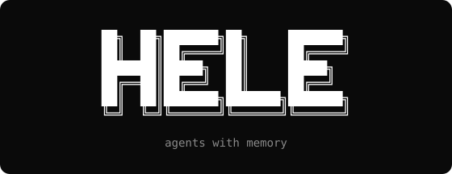

<p align="center">
  
</p>

A feature-delivery harness for Claude Code. One command: `/hele-yolo`. It picks the lane and runs the rest.

📚 **[Full documentation](.docs/README.md)** — introduction, getting started, skills and CLI references · [Changelog](CHANGELOG.md)

**Core belief:** agents have no memory — we build it for them. Every feature leaves behind documents that explain WHAT it is and WHY it exists, HOW it was built, and HOW to validate it. Future sessions read those documents instead of guessing.

Work is organized with [beads](https://beads.gascity.com/) (`bd`), a dependency-aware issue tracker built for agents: every planned task becomes a beads issue, the build loop dispatches whatever `bd ready` unblocks, and an interrupted session resumes exactly where it stopped — the state lives in beads, not in the chat.

## The vision

Everyone is talking about AI and coding agents. After some time reflecting, I reached a surprising conclusion: in terms of software engineering structure, nothing changed. What changed is the scale and who operates that structure. It used to be a boss with **10 humans on the team**. Now it's a programmer with **10 agents on the team**.

See if this looks like your context at a tech company.

There is a task. A product manager understands the what, the why, and how to validate that feature. Along the way they ask a lot of questions to the people involved: sales, the customer themselves, the company's CEO. They still don't talk to the software engineer. In the end, they consolidate everything into a file — known as a *"Product Requirement"*, *"PRD"*, *"Product Scope"*, *"Epic"*. It has plenty of fancy names.

Once that exists, the staff engineer (or the engineering manager) picks up the file, understands it (or goes back to product with questions) and, together with the team, splits the work across frontend, backend, design, infra — whatever it takes. Now the group has its tasks and executes like a conductor coordinating an orchestra. When someone gets stuck, it escalates to the manager, the staff engineer, or product. If that person can't solve it either, they go find the answers and come back with direction. The cycle repeats until what needs to be finished is finished.

At the end, a QA (or the CI itself) validates what was built: opens the browser, tests it. The product person does that job too. Bottom line: input ↔ output. Feature delivered.

The next step is talking about it. The famous retrospective. Like any decent agile team, at the end of the cycle everyone sits together and reviews what worked, what didn't, which instruction was ambiguous, which step caused rework, and plenty more. Everyone leaves knowing a bit more than when they came in, and the next cycle costs less.

In the world of AI and agents, why should this flow be any different? It shouldn't. The difference is that now that whole team is you and several Claude Codes running together.

## The flow

```
 ╭─ You ──────────────────────────────────────── START ─╮
 │ /hele-yolo "what you need"                           │
 │ One command. It picks the lane and runs the rest.   │
 ╰──────────────────────────────────────────────────────╯
    │
    ▼
 ╭─ It detects the lane ────────────────────────────────╮
 │ Feature   new PRD + stubs + increment 001            │
 │ Fast      patch the PRD + a new increment            │
 │ Bugfix    patch the PRD + a new increment            │
 │ Open      research, review, investigation, design    │
 ╰──────────────────────────────────────────────────────╯
    │  feature / fast / bugfix — yolo runs these
    ▼
 ╭─ PRD + stubs ─────────────────────────── SAME STOP ─╮
 │ Agent Hightower + Agent Wylie                        │
 │ ▸ PRODUCT_DESCRIPTION.md + TEST_STUBS.md             │
 │ ▸ PRD delta: New vs Added (full PWD paths)           │
 ╰──────────────────────────────────────────────────────╯
    │
    ▼
 ╭─ design (only if new screens) ───────────────────────╮
 │ Agent Vega · skipped when no new screens / no design │
 │ ▸ DESIGN_SPEC.md                                     │
 ╰──────────────────────────────────────────────────────╯
    │
    ▼
 ╭─ plan ───────────────────────────────────────────────╮
 │ Agent Lisbon                                         │
 │ ▸ EXECUTION_PLAN.md + beads                          │
 ╰──────────────────────────────────────────────────────╯
    │
    ▼
 ╭─ build ──────────────────────────────────────────────╮
 │ Agents Cho, Van Pelt, Jane, Rigsby                   │◄──┐
 │ ▸ code + passing tests                               │   │
 │ ▸ from-qa → fixes the QA report                      │   │
 ╰──────────────────────────────────────────────────────╯   │
    │                                                       │
    ▼                                                       │
 ╭─ QA ─────────────────────────── SCREENSHOT PROOF ─╮      │
 │ Agent Wylie                                       │      │
 │ ▸ Playwright + screenshots + QA_REPORT.md         │──┐   │
 ╰───────────────────────────────────────────────────╯  │   │
    │                                                   │   │
    │     ╭─ QA generate-fixes-report ──────────────╮   │   │
    │     │ reconstruct QA_REPORT → approve fixes   │◄──┘   │
    │     ╰──────────────────┬──────────────────────╯       │
    │                        └──────────────────────────────┘
    ▼
 ╭─ verify ────────────────────────── YOU REPLAY QA ─╮
 │ Agent Wylie + you                                  │
 │ ▸ same steps + data from QA_REPORT → VERIFY.md     │
 ╰────────────────────────────────────────────────────╯
    │
    ▼
 ╭─ close ────────────────────────────────────────────╮
 │ Options: Work done · iterate · draft PR            │
 │ Findings written during the talk → findings.json   │
 ╰────────────────────────────────────────────────────╯

 ╭─ always ───────────────────────────────────────────╮
 │ First time in a repo → init runs by itself         │
 │ Every stop ends with numbered options              │
 │ Open lane stays a conversation until formalize     │
 │ /hele-status — the board (read-only)               │
 ╰────────────────────────────────────────────────────╯
```

### Lanes inside `/hele-yolo`

You type one command. Lisbon detects the lane and runs the phase skills. Every stop ends in numbered options — `1` approves and starts the next phase; `2` is tell me what you need; close stops include **Work done** and **Let's formalize**.

| Lane | When | What happens |
|---|---|---|
| Feature | Product does not do this today | New PRD + stubs + increment `001`, then design? → plan → build → QA → verify |
| Fast | Small addition to what exists | Patch PRD + stub delta + new increment, same spine |
| Bugfix | Behavior today is wrong | Same as Fast (reconcile docs, new increment, spine) |
| Open | Research, review, investigation, design explore | No PRD until you pick Let's formalize |

First time in a repo, init runs by itself. Findings land in `.hele/findings.json` while you talk (durable lessons → `LEARNINGS.md`). QA writes screenshots into a human-readable `QA_REPORT.md`; verify replays those same steps. Every file path in chat is the full working-directory path. A PRD change always prints a New vs Added delta.

### The iterate loop

Already past build and you found something you did not plan for? Still under `/hele-yolo` (or pick iterate on the verify close Options). Agent Lisbon folds it back into the open increment via beads — not a new Feature lane.

```
you: "wait — I forgot this", or pick iterate on the close Options
        │
        ▼
  iterate   (Agent Lisbon)
        │
        ├─ bug / behavior / tests / new screen / schema / security
        ▼
  re-verify only the affected surface
```

Say **build til pass** (or `builda até passar`) anytime and Lisbon dispatches `[AGENT] Summer` for the project compile — that is not the increment build loop.
## The team

| Tag | Agent | Role | Default model |
|---|---|---|---|
| `[AGENT PM]` | Hightower | Product Manager — owns PRDs, chases delivery, reports to the human | Fable 5 |
| `[AGENT STAFF]` | Lisbon | Staff Engineer — architecture, plans, staffs and routes the team | Fable 5 |
| `[AGENT DESIGN]` | Vega | UI/UX Designer — design-system map, design specs | Opus 5 |
| `[AGENT BE]` | Cho | Backend Engineer — TDD executor | Sonnet 5 |
| `[AGENT FE]` | Van Pelt | Frontend Engineer — implements from design specs, TDD | Sonnet 5 |
| `[AGENT DBA]` | Red John | DBA — schema guardian: DB change specs need your approval before any migration | Sonnet 5 |
| `[AGENT SEC]` | Jane | Security Engineer — threat-models risky increments | Fable 5 |
| `[AGENT INFRA]` | Rigsby | Infra Engineer — CI, environments, deploys | Sonnet 5 |
| `[AGENT QA]` | Wylie | QA — writes TEST_STUBS (Fable 5), turns them into Playwright e2e tests (Sonnet 5), hosts your guided verification | split |
| `[AGENT]` | Summer | Compile fixer — "build until pass". Cho's CI | via `staff-lisbon-run` |

The human answers what agents cannot, unblocks the real world, and picks the numbered options. Agents ask questions during planning phases — that is a feature, not a failure.

Models live in `.hele/settings.json` (`agents.models`) — judgment work (PRDs, plans, security, stub authoring) on the strong model, execution volume (engineers, QA runs, the BUILD suite, Summer's compile-until-green) on the cheap one. Keys are role-prefixed so the role is obvious (`backend-cho`, `frontend-van-pelt`, `qa-wylie-stubs` / `qa-wylie-run`, `staff-lisbon` / `staff-lisbon-run`), and each value is per-runtime: `{"claude-code": "sonnet", "cursor": "composer"}`. Change per project: `hele config set agents.models.backend-cho.claude-code opus`. Hightower and Lisbon *conduct* in the main session (the human's line). Their doing work — review, suite, artifacts — is a beads task dispatched as a background sub-agent on `staff-lisbon` (review/plan) / `staff-lisbon-run` (suite: Sonnet) / `pm-hightower`. `[AGENT] Summer` (build until pass) also runs on `staff-lisbon-run`. After each dispatch the turn ends so the line stays open — talk while they run.

## Project layout (created by /hele-init)

```
.hele/
  settings.json            # models, max agents, design system paths, everything
  state.json               # active feature + increment + phase
  index.json               # registry of ALL features (slug, aliases, versions, status)
  LEARNINGS.md             # memory promoted from session findings — every skill loads it
  findings.json            # append-only session findings written during /hele-yolo
  DESIGN_SYSTEM.md         # Vega's compact map of the design system (when one exists)
  DATABASE.md              # Red John's living schema map (mermaid ER, kept current)
  features/
    <slug>/
      PRODUCT_DESCRIPTION.md   # living doc — current state, patch versions only
      TEST_STUBS.md            # living doc — written with the PRD; QA runs the increment slice
      increments/
        001-<name>/
          EXECUTION_PLAN.md    # per-increment, frozen after build
          DESIGN_SPEC.md       # per-increment, when UI is involved
          DB_CHANGES.md        # per-increment, when the DB is touched — blocking approval
          QA_REPORT.md         # human-readable QA run + screenshots/
          VERIFY.md            # guided replay of the QA report
          screenshots/         # TS-nnn.png proof from Playwright
```

## Versioning rules

- Docs carry `version` in frontmatter plus a `## Changelog` section. **Patch-only** (1.0 → 1.1 → 1.2).
- A ground-up rebuild is **a new feature folder** (`checkout-discount-v2`), never a major bump.
- Derived docs carry `based_on: PRODUCT_DESCRIPTION vX.Y` — `/hele-status` flags stale docs mechanically.
- `PRODUCT_DESCRIPTION` is written as **state, not history**: superseded rules are rewritten, not appended. History lives in the changelog and git. Like `QA_REPORT.md`, the PRD is human-readable markdown with no XML — sections are `## What`, `## Why`, `## Flows`, `## Business rules`, and so on.

## Finding features (anti-duplicate)

Skills never grep ad hoc. They search through `hele find` against `index.json` (slug, title, aliases in EN/PT, summary) with content fallback — and the Feature lane has a hard gate: no new feature is created before searching and confirming with the human that it is not an update to an existing one.

## Install

```bash
claude plugin marketplace add guscsales/hele-skills
claude plugin install hele-skills@hele
claude plugin install hele-skills@hele -s project   # this repo, shared with the team
```

Working from a local clone (contributors):

```bash
claude plugin marketplace add /path/to/hele-skills
claude plugin install hele-skills@hele
```

## Repo layout

```
.claude-plugin/     plugin + marketplace manifests
skills/             one folder per /hele-* skill
agents/             the personas (shared by all skills)
templates/          output templates — file artifacts AND chat report tables
references/         standards the agents cite
cli/                the hele CLI — Node + commander (src/ + bundled dist/)
scripts/hele        thin shim: skills call ${CLAUDE_PLUGIN_ROOT}/scripts/hele
```

## CLI

Node CLI built with [commander](https://github.com/tj/commander.js) — Claude Code runs on Node, so every hele user already has the runtime. The bundle (`cli/dist/hele.cjs`) is committed: the plugin needs no `npm install` at runtime.

```
hele ai [skill]          understand the AI workflow — skills, agents, artifacts
hele find <query...>     search the feature index (agents MUST use this, never ad-hoc grep)
hele find --list         list all registered features
hele config get|set|add  read/write .hele/settings.json by dot path
hele install [--check]   install the beads CLI (brew or official script)
hele --help              banner + full listing
```

Use it directly in your terminal:

```bash
cd cli && npm link        # dev setup — `hele <command>` anywhere
# once published: npm i -g hele-cli
```

Contributing: edit `cli/src/`, then rebuild and commit `cli/dist/hele.cjs` (`cd cli && npm run build`). CI fails if that bundle is stale. The plugin skills live in `skills/` / `agents/` / `templates/` — Claude Code only.
