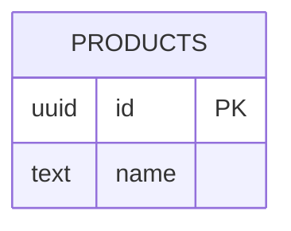
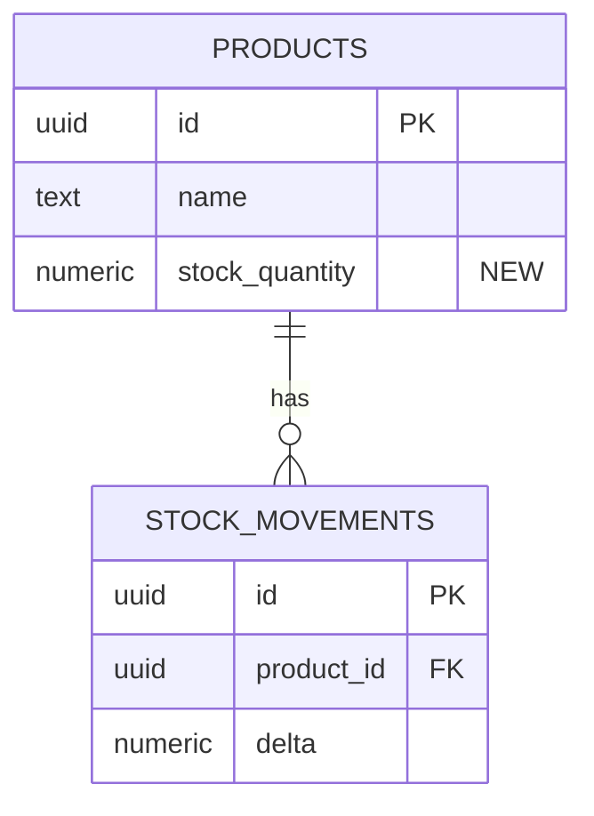

<!--
RULES FOR THIS DOCUMENT
- Owned by [AGENT DBA] Red John. Required whenever an increment touches
  schema, indexes, backfills, or production seeds. New queries against
  existing structures do NOT require it.
- CEO approval of this doc is BLOCKING: the EXECUTION_PLAN cannot be
  approved, and /hele-build will not dispatch migration tasks, while this
  is draft.
- Changes are numbered (DB-n) and each cites the plan task or business
  rule that needs it. Irreversible operations are flagged in bold.
- After the migration is applied, Red John updates the living map
  .hele/DATABASE.md to the new current state.
-->

# DB Changes — <increment title>

<current-state>
The affected slice of today's schema (from .hele/DATABASE.md).

</current-state>

<proposed>
The same slice after this increment.

</proposed>

<changes>
- DB-1: <change, DDL-level precision> — needed by <task/BR reference>
- DB-2: ...
</changes>

<data-migration>
Backfills, seeds, transformations — with volume estimates. "None" is a valid answer.
</data-migration>

<rollback>
How to revert each DB-n. **IRREVERSIBLE:** flag any change that cannot be rolled back (dropped column with data, destructive backfill) — these need explicit CEO acknowledgment.
</rollback>

<risks>
- R-1: <lock/size/ordering risk> → <mitigation, e.g. "deploy code before migrating", "concurrent index build">
</risks>

## Changelog

- v1.0 (YYYY-MM-DD) — initial version
