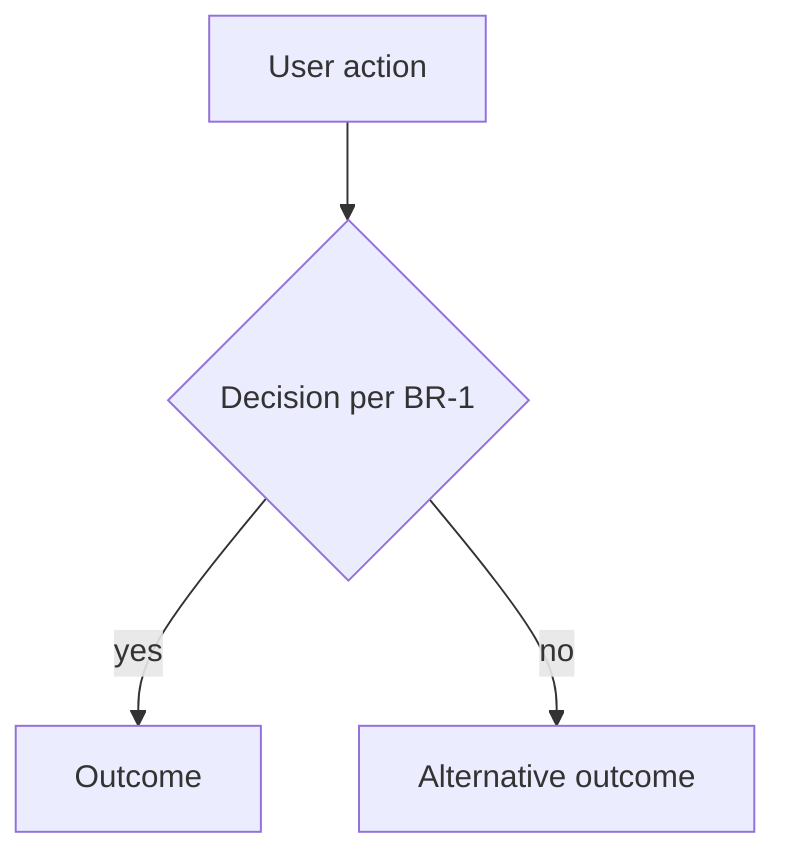

<!--
RULES FOR THIS DOCUMENT
- Written as STATE, not history: it describes how the product works TODAY.
  A superseded rule is REWRITTEN in place, never appended below the old one.
- Patch-only versioning (1.0 → 1.1 → 1.2). A ground-up rebuild is a NEW
  feature folder (<slug>-v2), never a major bump here.
- Every edit bumps the patch version, updates `updated`, adds a changelog line.
- Dual audience: XML section tags (<what>, <why>, <flows>, <business-rules>,
  <scope>, <glossary>, <open-questions>) are the AI contract — keep them so
  agents can locate sections. Inside each tag, write markdown a CEO can read
  in preview: headings, tables, numbered steps, named mermaid diagrams.
  Do not flatten a testable rule into a one-line bullet.
- status: approved requires <open-questions> to be empty.
- Business rules are numbered (BR-n) and testable — TEST_STUBS reference them.
  Each rule is a ### BR-n — Title heading with enough prose to review alone.
-->

# <Feature Title>

<what>

One or two paragraphs: what this feature is, in product terms. Present tense, current state.

Bullets are fine for the operational beats a reader should not miss.

</what>

<why>

The problem it solves and why it exists. The business value. What breaks or is lost if it doesn't exist.

</why>

<flows>

<!-- One or more mermaid diagrams of the main user/system flows. At least the
     happy path; add a named diagram when business rules branch.
     Caption each with ###. Reference BR-n ids on edges/nodes where a rule
     governs the branch. -->

### <Named flow — happy path>

</flows>

<business-rules>

### BR-1 — <short title>

The rule in prose — unambiguous, testable. Numbered steps for sequences (dialogs, persist order). A markdown table when the rule is a matrix (status × action, role × permission).

| Status | Action A | Action B |
|---|---|---|
| <state> | yes | no |

### BR-2 — <short title>

...

</business-rules>

<scope>

### In scope

- ...

### Out of scope

| Left out | Why |
|---|---|
| <thing> | <why it was intentionally left out> |

</scope>

<glossary>

<!-- Optional. Kill ambiguity: terms the team must use consistently. Omit the
     table (keep the tags) when there are no terms. -->

| Term | Meaning |
|---|---|
| <term> | <meaning> |

</glossary>

<open-questions>

<!-- Must be empty before status: approved. Owner is who must answer. -->

- OQ-1: <question> (owner: CEO)

</open-questions>

## Changelog

- v1.0 (YYYY-MM-DD) — initial version
