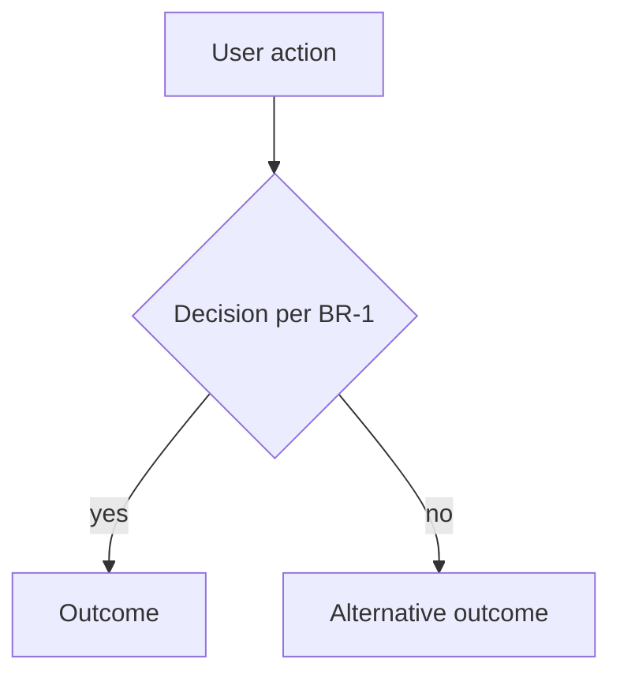

<!--
RULES FOR THIS DOCUMENT
- Written as STATE, not history: it describes how the product works TODAY.
  A superseded rule is REWRITTEN in place, never appended below the old one.
- Patch-only versioning (1.0 → 1.1 → 1.2). A ground-up rebuild is a NEW
  feature folder (<slug>-v2), never a major bump here.
- Every edit bumps the patch version, updates `updated`, adds a changelog line.
- status: approved requires <open-questions> to be empty.
- Business rules are numbered (BR-n) and testable — TEST_STUBS reference them.
-->

# <Feature Title>

<what>
One or two paragraphs: what this feature is, in product terms. Present tense, current state.
</what>

<why>
The problem it solves and why it exists. The business value. What breaks or is lost if it doesn't exist.
</why>

<flows>
<!-- One or more mermaid diagrams of the main user/system flows. At least the
     happy path; add decision-heavy flows when business rules branch.
     Reference BR-n ids on edges/nodes where a rule governs the branch. -->

</flows>

<business-rules>
- BR-1: <one rule — unambiguous, testable>
- BR-2: ...
</business-rules>

<scope>
  <in-scope>
  - ...
  </in-scope>
  <out-of-scope>
  - <thing> — <why it was intentionally left out>
  </out-of-scope>
</scope>

<glossary>
<!-- Optional. Kill ambiguity: terms the team must use consistently. -->
- <term>: <meaning>
</glossary>

<open-questions>
<!-- Must be empty before status: approved. Owner is who must answer. -->
- OQ-1: <question> (owner: CEO)
</open-questions>

## Changelog

- v1.0 (YYYY-MM-DD) — initial version
