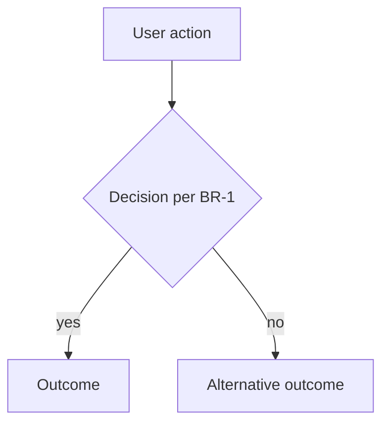

<!-- RULES:
- Written as STATE, not history: it describes how the product works TODAY.
  A superseded rule is REWRITTEN in place, never appended below the old one.
- Patch-only versioning (1.0 → 1.1 → 1.2). A ground-up rebuild is a NEW
  feature folder (<slug>-v2), never a major bump here.
- Every edit bumps the patch version, updates `updated`, adds a changelog line.
- Human-readable markdown ONLY. No XML section tags. A person opens this file
  and understands the product: what, why, flows, rules, scope. Agents find
  sections by the ## / ### headings below.
- status: approved requires Open questions to be empty (or the section omitted).
- Business rules are numbered (BR-n) and testable — TEST_STUBS reference them.
  Each rule is a ### BR-n — Title heading with enough prose to review alone.
- Each named flow: ### caption, then a short prose paragraph, then the mermaid,
  then a Branch | Rule table listing every BR-n that governs a branch in THAT
  diagram (not a dump of all rules). Keep BR-n on mermaid edges/nodes too.
- Written in English, like every artifact.
-->
---
feature: <slug>
doc: PRODUCT_DESCRIPTION
version: "1.0"
status: draft # draft | approved
updated: YYYY-MM-DD
---

# <Feature Title>

## What

One or two paragraphs: what this feature is, in product terms. Present tense, current state.

Bullets are fine for the operational beats a reader should not miss.

## Why

The problem it solves and why it exists. The business value. What breaks or is lost if it doesn't exist.

## Flows

One or more mermaid diagrams of the main user/system flows. At least the happy path; add a named diagram when business rules branch.

Per diagram: `###` caption → short prose paragraph → mermaid → Branch|Rule table. Reference BR-n ids on edges/nodes where a rule governs the branch. The table is the human index for that diagram only.

### <Named flow — happy path>

One or two sentences: what this flow covers and the main fork a reader should notice before reading the diagram.

| Branch | Rule |
|---|---|
| <what the yes path means> | BR-1 |
| <what the no path means> | BR-2 |

## Business rules

### BR-1 — <short title>

The rule in prose — unambiguous, testable. Numbered steps for sequences (dialogs, persist order). A markdown table when the rule is a matrix (status × action, role × permission).

| Status | Action A | Action B |
|---|---|---|
| <state> | yes | no |

### BR-2 — <short title>

...

## Scope

### In scope

- ...

### Out of scope

| Left out | Why |
|---|---|
| <thing> | <why it was intentionally left out> |

## Glossary

Optional. Kill ambiguity: terms the team must use consistently. Omit this section when there are no terms.

| Term | Meaning |
|---|---|
| <term> | <meaning> |

## Open questions

Must be empty (or omit this section) before `status: approved`. Owner is who must answer.

- OQ-1: <question> (owner: human)

## Changelog

- v1.0 (YYYY-MM-DD) — initial version
